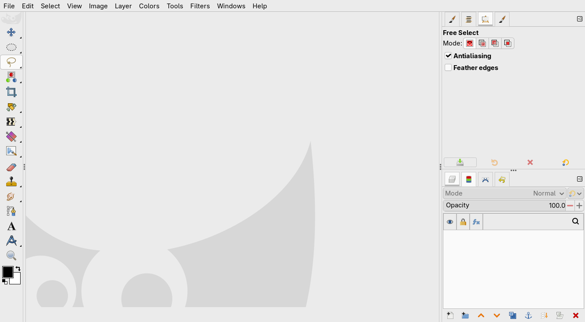

# Skeuomorphic-GIMP-icons
A vibrant, skeuomorphic GIMP icon theme

For now, the only icons changed are the tool icons.

## Screenshots

## Goals

- Have seperate dark/light icons as dark theme requires white outlines, lower saturation and lighter colours. This does however make the theme harder to apply and annoying for users who regularly switch between light and dark.
- Use a "skeuomorphic" style with 3D designs and color to make icons that are seen in real life (e.g. the rubber) recognisable
- Use subtle highlights and shadows to give the icons some character and make them look realistic, not too much where they become hard to interpret and look dated
- Where icons aren't meant to mimic real life objects, they can be flat instead of skeuomorphic (e.g. transform tools)
- For the future: Not all icons must be colourful, e.g. why is the minus button red? This only looks distracting. 

## Building

run `sh gen.sh [light|dark]` to generate a theme into 'out' by combining 'common' and light or dark icons into one folder

Then copy the theme (or symlink it for development) to your GIMP icons folder ('.config/GIMP/3.2/icons/' on Linux)
